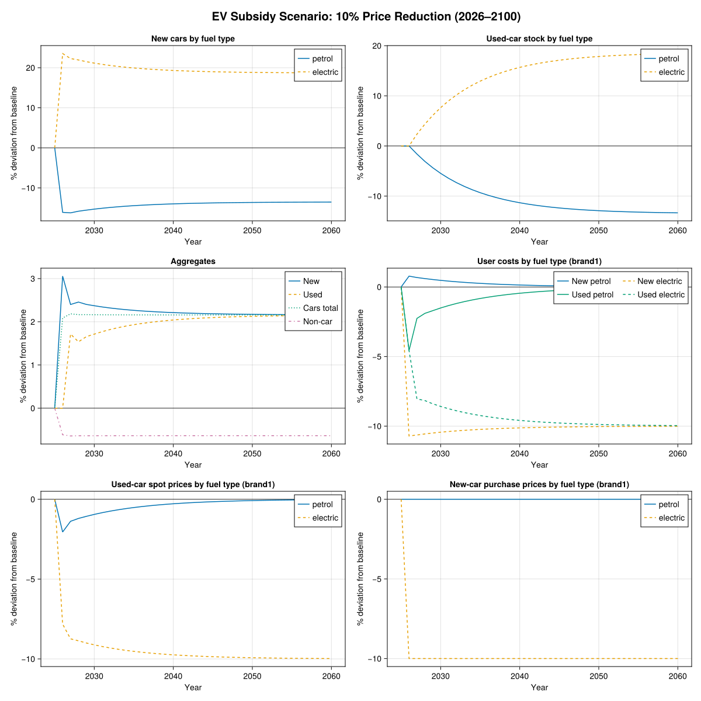
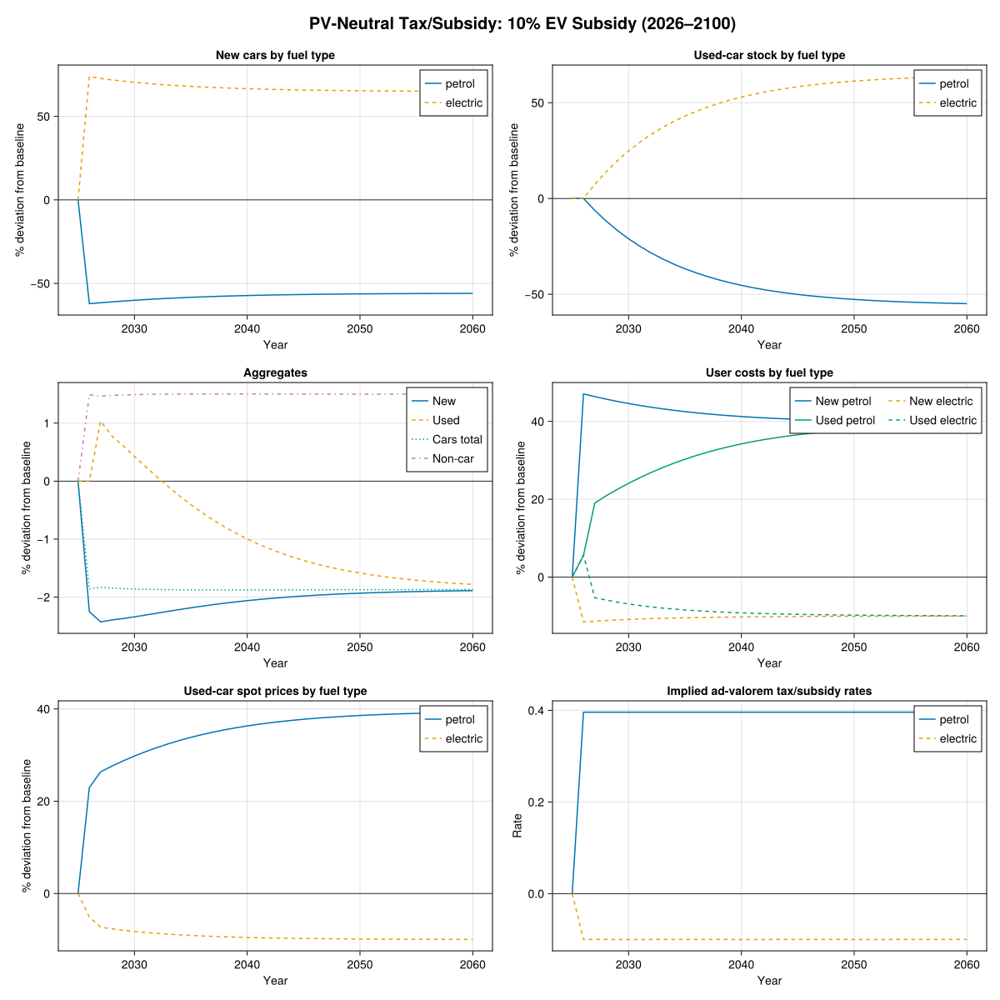
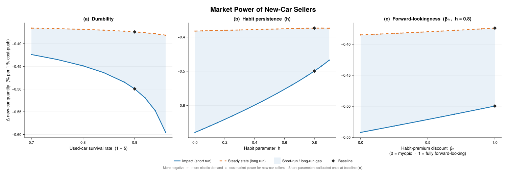

# Partial Equilibrium Model of New and Used Cars

A dynamic partial-equilibrium model of the car market implemented in Julia using [SquareModels](https://github.com/MartinBonde/SquareModels) and [Ipopt](https://github.com/coin-or/Ipopt). The model captures substitution between new and used cars across fuel types (petrol and electric), with habit formation in the used-car market. The car block is solved holding the rest of the economy fixed: non-car demand/prices are exogenous, and new-car supply is treated as perfectly elastic imports.

## Model Structure

The household allocates total consumption $`C_t`$ between a car-service aggregate $`d_t`$ and non-car consumption $`c_{nc,t}`$ via a nested CES demand system:

```
Total consumption C
├── Non-car consumption (c_nc)
└── Car-service aggregate (d)
    ├── New cars (d_new)
    │   ├── Petrol
    │   └── Electric
    └── Used cars (d_used)
        ├── Petrol (with habit)
        └── Electric (with habit)
```

Total consumption $`C_t`$ and the non-car price $`p_{nc,t}`$ are exogenous. The model determines the car/non-car split, allocation across new/used and fuel types, and the market-clearing prices.

## Demand Block (Partial Equilibrium)

The model is solved as a partial-equilibrium sequence with no feedback from the car market to the rest of the economy. At each date, total consumption $`C_t`$ and the non-car price $`p_{nc,t}`$ are exogenous, and car demand is represented by a nested CES system:

$$C_t = \left[\mu_{nc}^{1/\sigma_C} c_{nc,t}^{(\sigma_C-1)/\sigma_C} + \mu_d^{1/\sigma_C} d_t^{(\sigma_C-1)/\sigma_C}\right]^{\sigma_C/(\sigma_C-1)}$$

The car-service aggregate $`d_t`$ nests new and used cars:

$$d_t = \left[(\mu^{new})^{1/\sigma} (d_t^{new})^{(\sigma-1)/\sigma} + (\mu^{used})^{1/\sigma} (d_t^{used})^{(\sigma-1)/\sigma}\right]^{\sigma/(\sigma-1)}$$

New cars aggregate over fuel types:

$$d_t^{new} = \left[\sum_f (\mu_f^{new})^{1/\sigma^{new}} (d_{f,t}^{new})^{(\sigma^{new}-1)/\sigma^{new}}\right]^{\sigma^{new}/(\sigma^{new}-1)}$$

Used cars aggregate over fuel types with **habit formation**:

$$d_t^{used} = \left[\sum_f (\mu_f^{used})^{1/\sigma^{used}} \left(d_{f,t}^{used} - h_f d_{f,t-1}^{used}\right)^{(\sigma^{used}-1)/\sigma^{used}}\right]^{\sigma^{used}/(\sigma^{used}-1)}$$

The habit term $`h_f d_{f,t-1}^{used}`$ is the reference point: only the stock of fuel type $`f`$ in excess of this generates marginal utility. This creates inertia in the fuel-type composition of the used fleet — a household inheriting a large petrol stock finds it costly to shrink it because the habit-adjusted quantity $`d_{f,t}^{used} - h_f d_{f,t-1}^{used}`$ falls, depressing utility.
This fuel-specific persistence channel is in the spirit of deep-habits models, adapted here to durable used-car stocks rather than non-durable consumption flows.

## Stock Accumulation

Let $`a = 0`$ denote new cars so that $`d_{0,f,t} \equiv d^{new}_{f,t}`$. Cars of age $`a`$ depreciate at rate $`\delta_{a,f,t}`$ (which can vary by age, fuel type, and time) and the stock evolves as:

$$d_{a,f,t} = (1 - \delta_{a-1,f,t}) d_{a-1,f,t-1}, \quad a \geq 1$$

Used cars of a given fuel type are perfect substitutes, $`d^{used}_{f,t} = \sum_{a=1}^{\infty} d_{a,f,t}`$. If depreciation rates are age-independent for $`a \geq 1`$ (i.e. $`\delta_{a,f,t} = \delta_{f,t}`$ for all $`a \geq 1`$, while $`\delta_{0,f,t}`$ may differ), the stock simplifies to:

$$d^{used}_{f,t} = (1 - \delta_{f,t}) d^{used}_{f,t-1} + (1 - \delta_{0,f,t}) d^{new}_{f,t-1}$$

## Demand System

### Top level: cars vs. non-car consumption

$$d_t = \mu_d C_t \left(\frac{p^d_t}{p^C_t}\right)^{-\sigma_C}, \qquad c_{nc,t} = \mu_{nc} C_t \left(\frac{p_{nc,t}}{p^C_t}\right)^{-\sigma_C}$$

$$p^C_t C_t = p^d_t d_t + p_{nc,t} c_{nc,t}$$

### Car nest: new vs. used

$$d^{new}_t = \mu^{new} d_t \left(\frac{p^{uc,new}_t}{p^d_t}\right)^{-\sigma}, \qquad d^{used}_t = \mu^{used} d_t \left(\frac{p^{uc,used}_t}{p^d_t}\right)^{-\sigma}$$

$$p^d_t d_t = p^{uc,new}_t d^{new}_t + p^{uc,used}_t d^{used}_t$$

### New-car nest: across fuel types

$$d^{new}_{f,t} = \mu^{new}_f d^{new}_t \left(\frac{p^{uc,new}_{f,t}}{p^{uc,new}_t}\right)^{-\sigma^{new}}$$

$$p^{uc,new}_t d^{new}_t = \sum_f p^{uc,new}_{f,t} d^{new}_{f,t}$$

The user cost of a new car of fuel type $`f`$ is:

$$p^{uc,new}_{f,t} = p^{new}_{f,t} - \frac{1 - \delta_{0,f,t+1}}{1 + r_{t+1}} p^{used}_{f,t+1}$$

### Used-car nest: across fuel types (with habits)

The CES aggregator in this nest is defined over habit-adjusted quantities $`d^{used}_{f,t} - h_f d^{used}_{f,t-1}`$, where $`h_f \in (0,1)`$ is a habit parameter. Only the stock in excess of the habit reference point generates marginal utility, creating inertia: a household with a large inherited stock of fuel type $`f`$ finds it costly to reduce holdings.

$$d^{used}_{f,t} - h_f d^{used}_{f,t-1} = \mu^{used}_f d^{used}_t \left(\frac{p^{uc}_{f,t}}{p^{uc,used}_t}\right)^{-\sigma^{used}}$$

$$p^{uc,used}_t d^{used}_t = \sum_f p^{uc}_{f,t} \left(d^{used}_{f,t} - h_f d^{used}_{f,t-1}\right)$$

The user cost of a used car of fuel type $`f`$ is:

$$p^{uc}_{f,t} = p^{used}_{f,t} - \frac{1 - \delta_{f,t+1}}{1 + r_{t+1}} p^{used}_{f,t+1} + \beta_h \frac{1 - \delta_{f,t+1}}{1 + r_{t+1}} h_f p^{uc,used}_{t+1} \mu^{used}_f \left(\frac{d^{used}_{t+1}}{d^{used}_{f,t+1} - h_f d^{used}_{f,t}}\right)^{1/\sigma^{used}}$$

The third term is the **habit premium**: holding more used cars of type $`f`$ today raises next period's reference point by $`h_f(1 - \delta_{f,t+1})`$, reducing the effective service flow and increasing the marginal cost of maintaining the same utility level tomorrow. When $`h_f = 0`$ the habit premium vanishes. The parameter $`\beta_h \in [0,1]`$ controls how forward-looking the household is with respect to this habit: $`\beta_h = 1`$ is fully forward-looking (the baseline), $`\beta_h = 0`$ is myopic.

## Calibration

The share parameters $`\mu_d, \mu_{nc}, \mu^{new}, \mu^{used}, \mu^{new}_f, \mu^{used}_f`$ are calibrated by swapping them for initial-period quantities and solving for the values that match base-year data.

### Baseline Parameters

| Parameter | Value | Description |
|-----------|-------|-------------|
| $`\sigma_C`$ | 0.5 | Elasticity: cars vs. non-car |
| $`\sigma`$ | 3.0 | Elasticity: new vs. used |
| $`\sigma^{new}`$ | 3.0 | Elasticity: across fuel types (new) |
| $`\sigma^{used}`$ | 3.0 | Elasticity: across fuel types (used) |
| $`h_f`$ | 0.8 | Habit parameter (both fuel types) |
| $`\beta_h`$ | 1.0 | Habit-premium discount (fully forward-looking) |
| $`r`$ | 0.04 | Interest rate |
| $`\delta_0`$ | 0.25 | First-period depreciation (new to used) |
| $`\delta`$ | 0.10 | Ongoing used-car depreciation |

## Scenario 1: EV Subsidy

The first scenario simulates a **10% reduction in the purchase price of electric cars** from 2026 onward. The unfinanced subsidy shifts new-car demand toward electric vehicles, gradually building up the electric used-car stock as cheaper EVs flow through the depreciation pipeline, while all equilibrium prices adjust.

### Results



- **New cars by fuel type** — Electric purchases rise while petrol purchases contract.
- **Used-car stock by fuel type** — The stock responds with a lag as new electric cars depreciate into the used market; the petrol stock declines as fewer petrol cars enter the pipeline.
- **Aggregates** — Total new-car purchases increase, funded by the unfinanced subsidy.
- **User costs by fuel type** — The user cost of new electric cars drops directly with the price reduction; used-car user costs adjust endogenously as stock composition shifts.
- **Used-car spot prices by fuel type** — The growing stock of electric vehicles depresses electric resale values; used petrol prices edge up as the petrol stock thins.
- **New-car purchase prices by fuel type** — The exogenous shock: a flat 10% reduction for electric cars, petrol unchanged.

## Scenario 2: PV-Neutral Tax/Subsidy

The second scenario pairs the **10% EV subsidy** with a **constant endogenous ad-valorem tax on petrol cars** $`\tau_{petrol}`$, calibrated so that the present value of net tax revenue is exactly zero:

$$\sum_t \frac{1}{(1+r_t)^{t-t_1}} \sum_f \tau_{f,t} p^{new}_{f,t} d^{new}_{f,t} = 0$$

The consumer-facing purchase price becomes $`p^{new}_{f,t}(1 + \tau_{f,t})`$, which enters the user cost of new cars.

The required petrol tax rate depends critically on the substitution elasticities. High fuel-type substitutability ($`\sigma^{new} = 3`$) means the EV subsidy erodes the petrol tax base aggressively — households switch away from petrol cars easily, shrinking the revenue that any given tax rate can raise. The petrol tax must therefore be *higher* than the 10% subsidy it finances. More generally, $`\tau_{petrol}`$ is an increasing function of $`\sigma^{new}`$: the easier it is to substitute between fuel types, the more the tax base shrinks, and the higher the rate needed to close the budget. In the limit $`\sigma^{new} \to \infty`$, the tax base vanishes entirely and no finite rate can balance the budget.

### Results



- **New cars by fuel type** — The simultaneous tax on petrol and subsidy on electric drives a larger compositional shift than Scenario 1, since both margins push in the same direction.
- **Used-car stock by fuel type** — The petrol used-car stock declines more steeply as the tax chokes off new petrol inflows at the source.
- **Aggregates** — Despite fiscal neutrality, the car aggregate $`d_t`$ falls. Both the subsidy and the tax distort relative prices away from their undistorted values, and the CES aggregator registers the combined efficiency loss as a decline in the car-service aggregate. Revenue neutrality balances the budget, not welfare.
- **User costs by fuel type** — A symmetric wedge opens up: petrol user costs rise due to the tax while electric user costs fall, creating a wider gap than the subsidy-only scenario.
- **Used-car spot prices by fuel type** — The petrol resale price *rises* as reduced future supply makes the surviving stock more scarce, while the electric resale price falls as subsidized vehicles flood the secondary market.
- **Implied tax/subsidy rates** — The constant −10% electric subsidy and the endogenous petrol tax that balances revenue in present value.

## Market Power of New-Car Sellers

This analysis measures the market power of new-car sellers by computing the **demand elasticity** from a permanent 1% exogenous increase in all new-car purchase prices $`p^{new}_{f,t}`$. The experiment is repeated across a grid of parameter values for:

- **(a)** **Durability** — parameterised by the ongoing used-car depreciation rate $`\delta`$, with the first-period depreciation $`\delta_0`$ fixed.
- **(b)** The **habit parameter** $`h`$ — which governs the strength of habit formation in the used-car nest.
- **(c)** The **habit-premium discount** $`\beta_h \in [0,1]`$ — which controls how forward-looking households are *with respect to the habit*. When $`\beta_h = 1`$ the household fully internalises the effect of today's used-car holdings on tomorrow's reference point; when $`\beta_h = 0`$ the household ignores the forward-looking consequences of the habit (while still experiencing the habit in its utility function).

The metric is the **demand elasticity** $`\% \Delta d^{new}`$: the percentage change in new-car purchases in response to the 1% cost-push. A *more negative* value means demand is more elastic, i.e. sellers have *less* market power.

The elasticity is computed at the **impact** (short-run dynamic response in 2026) and in the **steady state** (long-run comparative static).

### Approach: calibrate once, then vary structural parameters

The share parameters $`\mu_d, \mu_{nc}, \mu^{new}, \mu^{used}, \mu^{new}_f, \mu^{used}_f`$ are calibrated **once** at the baseline parameter values ($`\sigma = 3`$, $`h = 0.8`$, $`\beta_h = 1`$). The calibration targets are **stock-consistent**: the steady-state used-car stock is derived from the accumulation identity $`d^{used}_f = \frac{1-\delta_0}{\delta} d^{new}_f`$, and the new-car flow is scaled so that total car services (new plus habit-adjusted used) equal a 50% share of total consumption.

For each parameter variation, the un-swapped model is solved to obtain a counterfactual equilibrium — an economy with the same preferences (μ's) but different structural parameters. The cost-push shock is then applied on top of this counterfactual equilibrium and the demand response is measured.

### Results



#### (a) Effect of Durability

| $`1-\delta`$ | $`\delta`$ | Impact $`\%\Delta d^{new}`$ | SS $`\%\Delta d^{new}`$ |
|---:|---:|---:|---:|
| 0.96 | 0.04 | −0.596 | −0.381 |
| 0.94 | 0.06 | −0.548 | −0.378 |
| 0.92 | 0.08 | −0.519 | −0.376 |
| **0.90** | **0.10** | **−0.500** | **−0.374** |
| 0.88 | 0.12 | −0.485 | −0.372 |
| 0.84 | 0.16 | −0.464 | −0.370 |
| 0.80 | 0.20 | −0.449 | −0.368 |
| 0.75 | 0.25 | −0.435 | −0.367 |
| 0.70 | 0.30 | −0.424 | −0.366 |

**More durable cars reduce market power.** Lower $`\delta`$ means used cars last longer, building up a larger used-car stock in steady state ($`d^{used}_f = \frac{1-\delta_0}{\delta} d^{new}_f`$). This creates a larger competitive fringe that constrains new-car pricing — the **Coase conjecture** at work.

The effect is quantitatively more pronounced in the **short run** (impact) than in the steady state. The short-run response is larger because the used-car stock is predetermined at impact — it cannot adjust immediately — so the full forward-looking anticipation of future resale value changes is priced in at once, amplifying the demand response. At $`\delta = 0.04`$ (96% annual survival), the impact elasticity is nearly 40% larger in magnitude than at $`\delta = 0.30`$.

#### (b) Effect of Habit Persistence

| $`h`$ | Impact $`\%\Delta d^{new}`$ | SS $`\%\Delta d^{new}`$ |
|---:|---:|---:|
| 0.00 | −0.679 | −0.382 |
| 0.20 | −0.641 | −0.380 |
| 0.35 | −0.610 | −0.379 |
| 0.55 | −0.565 | −0.376 |
| 0.70 | −0.527 | −0.375 |
| **0.80** | **−0.500** | **−0.374** |
| 0.85 | −0.484 | −0.374 |
| 0.90 | −0.468 | −0.374 |

**Habit persistence has a non-monotonic effect on market power.** As $`h`$ rises from 0 to about 0.80, the demand elasticity becomes less negative (smaller quantity drop), meaning sellers gain market power through lock-in. Beyond $`h \approx 0.85`$, the steady-state elasticity reverses and demand becomes slightly *more* elastic again, while the impact elasticity continues to decrease in magnitude but at a decelerating rate.

Two competing forces explain this:

1. **Lock-in effect** (dominates at low-to-moderate $`h`$): Higher $`h`$ means households inheriting a used-car stock find it costly to deviate from their current composition, because the habit-adjusted service flow $`d^{used}_{f,t} - h d^{used}_{f,t-1}`$ shrinks. This reduces competitive pressure from the used market on new-car sellers, raising market power.

2. **Habit-premium feedback** (dominates at high $`h`$): When $`h`$ is very high, the habit premium in the user cost of used cars becomes large, raising the price of car services overall. With $`\sigma_C = 0.5 < 1`$ (cars and non-car goods are complements), this tightens the overall car budget and makes new-car demand more sensitive to cost-push shocks.

At the baseline calibration ($`h = 0.80`$), the model sits near the inflection point where these two forces approximately balance.

#### (c) Effect of Forward-Lookingness ($`\beta_h`$)

| $`\beta_h`$ | Impact $`\%\Delta d^{new}`$ | SS $`\%\Delta d^{new}`$ |
|---:|---:|---:|
| 0.0 (myopic) | −0.542 | −0.385 |
| 0.3 | −0.530 | −0.382 |
| 0.5 | −0.521 | −0.380 |
| 0.7 | −0.513 | −0.378 |
| **1.0** (fully forward-looking) | **−0.500** | **−0.374** |

**More forward-looking households face *less* elastic demand — i.e., new-car sellers have *more* market power.** This is the opposite of what one might expect, and it is also the opposite sign from the recalibration approach, confirming that controlling for calibration was important.

The mechanism: when $`\beta_h = 1`$, the household internalises the habit premium — it knows that holding more used cars today raises tomorrow's reference point. This makes used cars *more expensive* in effective terms (higher user cost). The higher user cost of used cars makes used cars a worse outside option for households, *reducing* competitive pressure on new-car sellers and giving them more pricing power.

When $`\beta_h = 0`$ (myopic), the household ignores the habit premium entirely. Used cars look cheaper than they "truly" are, so households treat them as a stronger competitive substitute to new cars. This makes new-car demand more elastic and reduces seller market power.

The effect is about 4.3 percentage points in the impact elasticity and 1.1 pp in the SS elasticity between the fully myopic and fully forward-looking cases. The sign is robust and monotonic across the entire grid.

#### Summary: Three Forces on Market Power

| Channel | Effect on market power | Mechanism |
|---|---|---|
| **Durability ↑** | ↓ Less market power | Durable goods compete with themselves (Coase conjecture) |
| **Habits ↑** | ↑ then ↓ (non-monotonic) | Lock-in dominates at low $`h`$; habit-premium feedback dominates at high $`h`$ |
| **Forward-lookingness ↑** | ↑ More market power | Internalising habit premium raises the effective cost of used cars, weakening the used-car outside option |

## Running

```julia
julia --project=. cars.jl
julia --project=. market_power.jl
```

`cars.jl` solves the baseline calibration, runs both counterfactual scenarios, and saves plots to `cars_baseline.svg`, `cars_scenario1.svg`, and `cars_scenario2.svg`.

`market_power.jl` calibrates the model once at baseline parameters, computes the demand elasticities for each parameter variation, and saves the three-panel figure to `market_power.svg`.

Both scripts share the model definition from `car_model.jl`.

### Dependencies

- [JuMP](https://github.com/jump-dev/JuMP.jl) + [Ipopt](https://github.com/jump-dev/Ipopt.jl) — nonlinear optimization
- [SquareModels](https://github.com/MartinBonde/SquareModels) — model definition and solution framework
- [CairoMakie](https://github.com/MakieOrg/Makie.jl) — plotting

## References

- Coase, R. H. (1972). Durability and Monopoly. *Journal of Law and Economics*, 15(1), 143-149.
- Stokey, N. L. (1981). Rational Expectations and Durable Goods Pricing. *The Bell Journal of Economics*, 12(1), 112-128.
- Berry, S., Levinsohn, J., & Pakes, A. (1995). Automobile Prices in Market Equilibrium. *Econometrica*, 63(4), 841-890.
- Goldberg, P. K. (1995). Product Differentiation and Oligopoly in International Markets: The Case of the U.S. Automobile Industry. *Econometrica*, 63(4), 891-951.
- Bento, A. M., Goulder, L. H., Jacobsen, M. R., & von Haefen, R. H. (2009). Distributional and Efficiency Impacts of Increased U.S. Gasoline Taxes. *American Economic Review*, 99(3), 667-699.
- Constantinides, G. M. (1990). Habit Formation: A Resolution of the Equity Premium Puzzle. *Journal of Political Economy*, 98(3), 519-543.
- Ravn, M., Schmitt-Grohé, S., & Uribe, M. (2006). Deep Habits. *Review of Economic Studies*, 73(1), 195-218.
