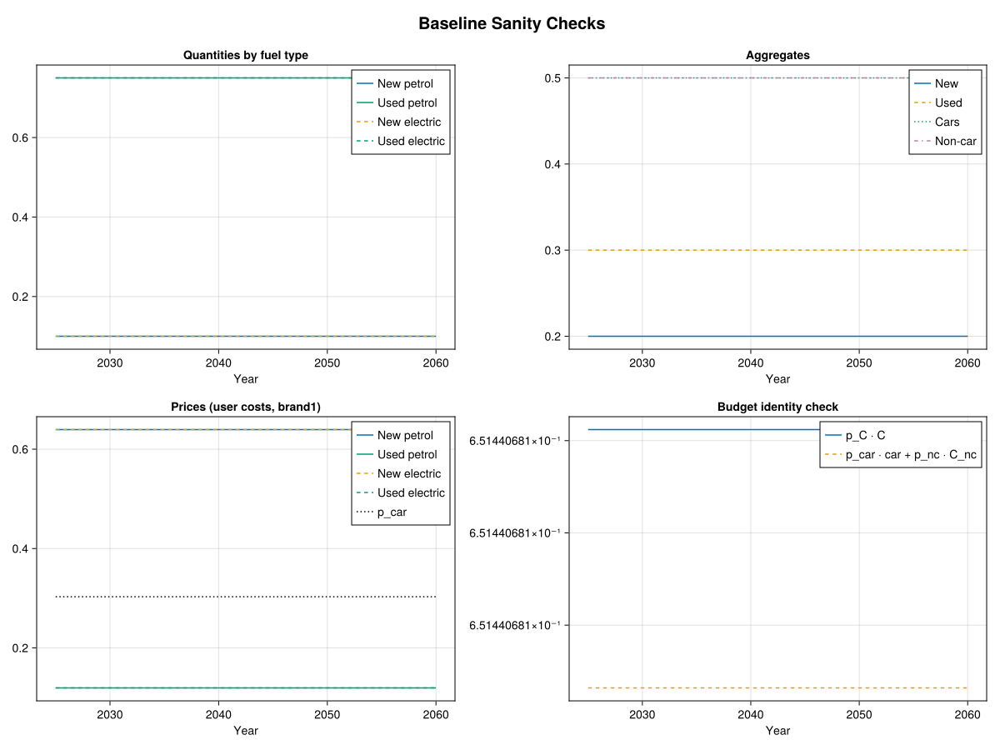
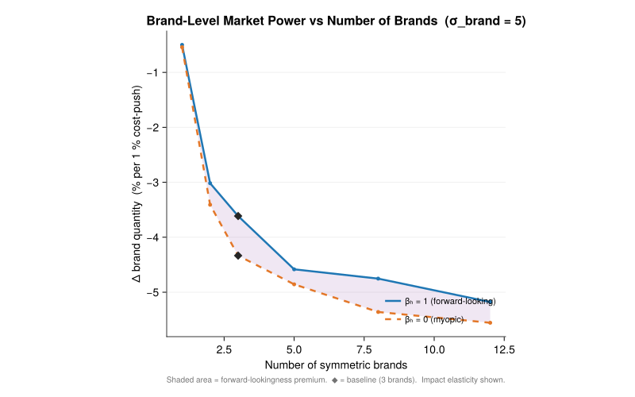

# Partial Equilibrium Model of New and Used Cars

A dynamic partial-equilibrium model of the car market implemented in Julia using [SquareModels](https://github.com/MartinBonde/SquareModels) and [Ipopt](https://github.com/coin-or/Ipopt). The model captures substitution between new and used cars across brands and fuel types (petrol and electric), with habit formation in the used-car market. The car block is solved holding the rest of the economy fixed: non-car demand/prices are exogenous, and new-car supply is treated as perfectly elastic imports.

## Model Structure

The household allocates total consumption $`C_t`$ between a car-service aggregate $`d_t`$ and non-car consumption $`c_{nc,t}`$ via a nested CES demand system:

```
Total consumption C
├── Non-car consumption (c_nc)
└── Car-service aggregate (d)
    ├── New cars (d_new)                          ← σ
    │   ├── Brand 1 (d_new_b1)                    ← σ_brand
    │   │   ├── Petrol                            ← σ_new
    │   │   └── Electric
    │   ├── Brand 2 (d_new_b2)
    │   │   └── ...
    │   └── Brand 3 (d_new_b3)
    │       └── ...
    └── Used cars (d_used)                        ← σ
        ├── Brand 1 (d_used_b1)                   ← σ_brand
        │   ├── Petrol (with habit)               ← σ_used
        │   └── Electric (with habit)
        ├── Brand 2 (d_used_b2)
        │   └── ...
        └── Brand 3 (d_used_b3)
            └── ...
```

Total consumption $`C_t`$ and the non-car price $`p_{nc,t}`$ are exogenous. The model determines the car/non-car split, allocation across new/used, brands, and fuel types, and the market-clearing prices. Brand differentiation carries through to the used-car market: a used car retains its brand identity, so stock accumulation and habits operate at the (brand, fuel) level.

## Demand Block (Partial Equilibrium)

The model is solved as a partial-equilibrium sequence with no feedback from the car market to the rest of the economy. At each date, total consumption $`C_t`$ and the non-car price $`p_{nc,t}`$ are exogenous, and car demand is represented by a nested CES system:

$$C_t = \left[\mu_{nc}^{1/\sigma_C} c_{nc,t}^{(\sigma_C-1)/\sigma_C} + \mu_d^{1/\sigma_C} d_t^{(\sigma_C-1)/\sigma_C}\right]^{\sigma_C/(\sigma_C-1)}$$

The car-service aggregate $`d_t`$ nests new and used cars:

$$d_t = \left[(\mu^{new})^{1/\sigma} (d_t^{new})^{(\sigma-1)/\sigma} + (\mu^{used})^{1/\sigma} (d_t^{used})^{(\sigma-1)/\sigma}\right]^{\sigma/(\sigma-1)}$$

New cars first aggregate over brands, then over fuel types within each brand:

$$d_t^{new} = \left[\sum_b (\mu_b^{new})^{1/\sigma_b} (d_{b,t}^{new})^{(\sigma_b-1)/\sigma_b}\right]^{\sigma_b/(\sigma_b-1)}$$

$$d_{b,t}^{new} = \left[\sum_f (\mu_f^{new})^{1/\sigma^{new}} (d_{b,f,t}^{new})^{(\sigma^{new}-1)/\sigma^{new}}\right]^{\sigma^{new}/(\sigma^{new}-1)}$$

Used cars share the same brand/fuel nesting. Within each brand, fuel types are aggregated with **habit formation**:

$$d_t^{used} = \left[\sum_b (\mu_b^{used})^{1/\sigma_b} (d_{b,t}^{used})^{(\sigma_b-1)/\sigma_b}\right]^{\sigma_b/(\sigma_b-1)}$$

$$d_{b,t}^{used} = \left[\sum_f (\mu_f^{used})^{1/\sigma^{used}} \left(d_{b,f,t}^{used} - h_f d_{b,f,t-1}^{used}\right)^{(\sigma^{used}-1)/\sigma^{used}}\right]^{\sigma^{used}/(\sigma^{used}-1)}$$

The habit term $`h_f d_{b,f,t-1}^{used}`$ is the reference point: only the stock of brand $`b`$, fuel type $`f`$ in excess of this generates marginal utility. This creates inertia in both the brand and fuel-type composition of the used fleet.
This persistence channel is in the spirit of deep-habits models, adapted here to durable used-car stocks rather than non-durable consumption flows.

## Stock Accumulation

Let $`a = 0`$ denote new cars so that $`d_{0,b,f,t} \equiv d^{new}_{b,f,t}`$. Cars of age $`a`$ depreciate at rate $`\delta_{a,f,t}`$ (which can vary by age, fuel type, and time) and the stock evolves as:

$$d_{a,b,f,t} = (1 - \delta_{a-1,f,t}) d_{a-1,b,f,t-1}, \quad a \geq 1$$

Used cars of a given brand and fuel type are perfect substitutes, $`d^{used}_{b,f,t} = \sum_{a=1}^{\infty} d_{a,b,f,t}`$. If depreciation rates are age-independent for $`a \geq 1`$ (i.e. $`\delta_{a,f,t} = \delta_{f,t}`$ for all $`a \geq 1`$, while $`\delta_{0,f,t}`$ may differ), the stock simplifies to:

$$d^{used}_{b,f,t} = (1 - \delta_{f,t}) d^{used}_{b,f,t-1} + (1 - \delta_{0,f,t}) d^{new}_{b,f,t-1}$$

## Demand System

### Top level: cars vs. non-car consumption

$$d_t = \mu_d C_t \left(\frac{p^d_t}{p^C_t}\right)^{-\sigma_C}, \qquad c_{nc,t} = \mu_{nc} C_t \left(\frac{p_{nc,t}}{p^C_t}\right)^{-\sigma_C}$$

$$p^C_t C_t = p^d_t d_t + p_{nc,t} c_{nc,t}$$

### Car nest: new vs. used

$$d^{new}_t = \mu^{new} d_t \left(\frac{p^{uc,new}_t}{p^d_t}\right)^{-\sigma}, \qquad d^{used}_t = \mu^{used} d_t \left(\frac{p^{uc,used}_t}{p^d_t}\right)^{-\sigma}$$

$$p^d_t d_t = p^{uc,new}_t d^{new}_t + p^{uc,used}_t d^{used}_t$$

### Brand nest: across brands (new and used)

Both new and used cars nest over brands with a common elasticity $`\sigma_b`$:

$$d^{new}_{b,t} = \mu^{new}_b d^{new}_t \left(\frac{p^{uc,new}_{b,t}}{p^{uc,new}_t}\right)^{-\sigma_b}, \qquad d^{used}_{b,t} = \mu^{used}_b d^{used}_t \left(\frac{p^{uc,used}_{b,t}}{p^{uc,used}_t}\right)^{-\sigma_b}$$

$$p^{uc,new}_t d^{new}_t = \sum_b p^{uc,new}_{b,t} d^{new}_{b,t}, \qquad p^{uc,used}_t d^{used}_t = \sum_b p^{uc,used}_{b,t} d^{used}_{b,t}$$

A brand owner who controls all fuel types within brand $`b`$ internalises within-brand substitution but competes against other brands at the $`\sigma_b`$ level. Higher $`\sigma_b`$ means more substitutable brands, reducing individual brand market power.

### Fuel-type nest within each brand (new cars)

$$d^{new}_{b,f,t} = \mu^{new}_f d^{new}_{b,t} \left(\frac{p^{uc,new}_{b,f,t}}{p^{uc,new}_{b,t}}\right)^{-\sigma^{new}}$$

$$p^{uc,new}_{b,t} d^{new}_{b,t} = \sum_f p^{uc,new}_{b,f,t} d^{new}_{b,f,t}$$

The user cost of a new car of brand $`b`$, fuel type $`f`$ is:

$$p^{uc,new}_{b,f,t} = p^{new}_{b,f,t} - \frac{1 - \delta_{0,f,t+1}}{1 + r_{t+1}} p^{used}_{b,f,t+1}$$

### Fuel-type nest within each brand (used cars, with habits)

The CES aggregator in this nest is defined over habit-adjusted quantities $`d^{used}_{b,f,t} - h_f d^{used}_{b,f,t-1}`$, where $`h_f \in (0,1)`$ is a habit parameter. Only the stock in excess of the habit reference point generates marginal utility, creating inertia: a household with a large inherited stock of brand $`b`$, fuel type $`f`$ finds it costly to reduce holdings.

$$d^{used}_{b,f,t} - h_f d^{used}_{b,f,t-1} = \mu^{used}_f d^{used}_{b,t} \left(\frac{p^{uc}_{b,f,t}}{p^{uc,used}_{b,t}}\right)^{-\sigma^{used}}$$

$$p^{uc,used}_{b,t} d^{used}_{b,t} = \sum_f p^{uc}_{b,f,t} \left(d^{used}_{b,f,t} - h_f d^{used}_{b,f,t-1}\right)$$

The user cost of a used car of brand $`b`$, fuel type $`f`$ is:

$$p^{uc}_{b,f,t} = p^{used}_{b,f,t} - \frac{1 - \delta_{f,t+1}}{1 + r_{t+1}} p^{used}_{b,f,t+1} + \beta_h \frac{1 - \delta_{f,t+1}}{1 + r_{t+1}} h_f p^{uc,used}_{b,t+1} \mu^{used}_f \left(\frac{d^{used}_{b,t+1}}{d^{used}_{b,f,t+1} - h_f d^{used}_{b,f,t}}\right)^{1/\sigma^{used}}$$

The third term is the **habit premium**: holding more used cars of brand $`b`$, type $`f`$ today raises next period's reference point by $`h_f(1 - \delta_{f,t+1})`$, reducing the effective service flow and increasing the marginal cost of maintaining the same utility level tomorrow. When $`h_f = 0`$ the habit premium vanishes. The parameter $`\beta_h \in [0,1]`$ controls how forward-looking the household is with respect to this habit: $`\beta_h = 1`$ is fully forward-looking (the baseline), $`\beta_h = 0`$ is myopic.

## Calibration

The share parameters $`\mu_d, \mu_{nc}, \mu^{new}, \mu^{used}, \mu^{new}_b, \mu^{used}_b, \mu^{new}_f, \mu^{used}_f`$ are calibrated by swapping them for initial-period quantities and solving for the values that match base-year data. Brands are symmetric at calibration: each brand gets an equal share of total new and used cars.

### Baseline Parameters

| Parameter | Value | Description |
|-----------|-------|-------------|
| $`\sigma_C`$ | 0.5 | Elasticity: cars vs. non-car |
| $`\sigma`$ | 3.0 | Elasticity: new vs. used |
| $`\sigma_b`$ | 5.0 | Elasticity: across brands |
| $`\sigma^{new}`$ | 3.0 | Elasticity: across fuel types within brand (new) |
| $`\sigma^{used}`$ | 3.0 | Elasticity: across fuel types within brand (used) |
| $`h_f`$ | 0.8 | Habit parameter (both fuel types) |
| $`\beta_h`$ | 1.0 | Habit-premium discount (fully forward-looking) |
| $`r`$ | 0.04 | Interest rate |
| $`\delta_0`$ | 0.25 | First-period depreciation (new to used) |
| $`\delta`$ | 0.10 | Ongoing used-car depreciation |
| Brands | 3 | Number of symmetric brands |

### Baseline Sanity Checks



## Scenario 1: EV Subsidy

The first scenario simulates a **10% reduction in the purchase price of electric cars** from 2026 onward. The unfinanced subsidy shifts new-car demand toward electric vehicles, gradually building up the electric used-car stock as cheaper EVs flow through the depreciation pipeline, while all equilibrium prices adjust.

### Results


- **New cars by fuel type** — Electric purchases rise while petrol purchases contract.
- **Used-car stock by fuel type** — The stock responds with a lag as new electric cars depreciate into the used market; the petrol stock declines as fewer petrol cars enter the pipeline.
- **Aggregates** — Total new-car purchases increase, funded by the unfinanced subsidy.
- **User costs by fuel type** — The user cost of new electric cars drops directly with the price reduction; used-car user costs adjust endogenously as stock composition shifts.
- **Used-car spot prices by fuel type** — The growing stock of electric vehicles depresses electric resale values; used petrol prices edge up as the petrol stock thins.
- **New-car purchase prices by fuel type** — The exogenous shock: a flat 10% reduction for electric cars, petrol unchanged.

## Scenario 2: PV-Neutral Tax/Subsidy

The second scenario pairs the **10% EV subsidy** with a **constant endogenous ad-valorem tax on petrol cars** $`\tau_{petrol}`$, calibrated so that the present value of net tax revenue is exactly zero:

$$\sum_t \frac{1}{(1+r_t)^{t-t_1}} \sum_{b,f} \tau_{b,f,t} p^{new}_{b,f,t} d^{new}_{b,f,t} = 0$$

The consumer-facing purchase price becomes $`p^{new}_{b,f,t}(1 + \tau_{b,f,t})`$, which enters the user cost of new cars.

The required petrol tax rate depends critically on the substitution elasticities. High fuel-type substitutability ($`\sigma^{new} = 3`$) means the EV subsidy erodes the petrol tax base aggressively — households switch away from petrol cars easily, shrinking the revenue that any given tax rate can raise. The petrol tax must therefore be *higher* than the 10% subsidy it finances. More generally, $`\tau_{petrol}`$ is an increasing function of $`\sigma^{new}`$: the easier it is to substitute between fuel types, the more the tax base shrinks, and the higher the rate needed to close the budget. In the limit $`\sigma^{new} \to \infty`$, the tax base vanishes entirely and no finite rate can balance the budget.

### Results


- **New cars by fuel type** — The simultaneous tax on petrol and subsidy on electric drives a larger compositional shift than Scenario 1, since both margins push in the same direction.
- **Used-car stock by fuel type** — The petrol used-car stock declines more steeply as the tax chokes off new petrol inflows at the source.
- **Aggregates** — Despite fiscal neutrality, the car aggregate $`d_t`$ falls. Both the subsidy and the tax distort relative prices away from their undistorted values, and the CES aggregator registers the combined efficiency loss as a decline in the car-service aggregate. Revenue neutrality balances the budget, not welfare.
- **User costs by fuel type** — A symmetric wedge opens up: petrol user costs rise due to the tax while electric user costs fall, creating a wider gap than the subsidy-only scenario.
- **Used-car spot prices by fuel type** — The petrol resale price *rises* as reduced future supply makes the surviving stock more scarce, while the electric resale price falls as subsidized vehicles flood the secondary market.
- **Implied tax/subsidy rates** — The constant −10% electric subsidy and the endogenous petrol tax that balances revenue in present value.

## Market Power of Individual Brand Owners

This analysis measures the market power of an **individual brand owner** by computing the **brand-level demand elasticity** from a permanent 1% exogenous increase in one brand's purchase prices $`p^{new}_{b,f,t}`$ (across all its fuel types). The brand owner internalises within-brand fuel-type substitution but competes against other brands at the $`\sigma_b`$ level. The experiment is repeated across a grid of parameter values for:

- **(a)** **Durability** — parameterised by the ongoing used-car depreciation rate $`\delta`$, with the first-period depreciation $`\delta_0`$ fixed.
- **(b)** The **habit parameter** $`h`$ — which governs the strength of habit formation in the used-car nest.
- **(c)** The **habit-premium discount** $`\beta_h \in [0,1]`$ — which controls how forward-looking households are *with respect to the habit*. When $`\beta_h = 1`$ the household fully internalises the effect of today's used-car holdings on tomorrow's reference point; when $`\beta_h = 0`$ the household ignores the forward-looking consequences of the habit (while still experiencing the habit in its utility function).
- **(d)** **Brand substitutability** $`\sigma_b`$ — how this interacts with forward-lookingness ($`\beta_h`$). For each value of $`\sigma_b`$, the elasticity is computed at both $`\beta_h = 1`$ (fully forward-looking) and $`\beta_h = 0`$ (myopic), to see whether more brand variety strengthens or weakens the forward-lookingness effect on market power.

The metric is the **brand-level demand elasticity** $`\% \Delta d^{new}_b`$: the percentage change in one brand's new-car purchases in response to the 1% cost-push on that brand only. A *more negative* value means demand is more elastic, i.e. the brand owner has *less* market power.

The elasticity is computed at the **impact** (short-run dynamic response in 2026) and in the **steady state** (long-run comparative static).

### Approach: calibrate once, then vary structural parameters

The share parameters $`\mu_d, \mu_{nc}, \mu^{new}, \mu^{used}, \mu^{new}_b, \mu^{used}_b, \mu^{new}_f, \mu^{used}_f`$ are calibrated **once** at the baseline parameter values ($`\sigma = 3`$, $`\sigma_b = 5`$, $`h = 0.8`$, $`\beta_h = 1`$). The calibration targets are **stock-consistent**: the steady-state used-car stock is derived from the accumulation identity $`d^{used}_{b,f} = \frac{1-\delta_0}{\delta} d^{new}_{b,f}`$, and the new-car flow is scaled so that total car services (new plus habit-adjusted used) equal a 50% share of total consumption. Brands are symmetric.

For each parameter variation, the un-swapped model is solved to obtain a counterfactual equilibrium — an economy with the same preferences (μ's) but different structural parameters. The cost-push shock is then applied to one brand on top of this counterfactual equilibrium and the brand-level demand response is measured.

### Results


#### (a) Effect of Durability

| $`1-\delta`$ | $`\delta`$ | Impact $`\%\Delta d^{new}_b`$ | SS $`\%\Delta d^{new}_b`$ |
|---:|---:|---:|---:|
| 0.96 | 0.04 | −4.551 | −3.471 |
| 0.94 | 0.06 | −4.147 | −3.379 |
| 0.92 | 0.08 | −3.849 | −3.300 |
| **0.90** | **0.10** | **−3.614** | **−3.232** |
| 0.88 | 0.12 | −3.419 | −3.173 |
| 0.84 | 0.16 | −3.107 | −3.077 |
| 0.80 | 0.20 | −2.864 | −3.002 |
| 0.75 | 0.25 | −2.621 | −2.928 |
| 0.70 | 0.30 | −2.425 | −2.869 |

**More durable cars reduce brand market power.** Lower $`\delta`$ means used cars last longer, building up a larger used-car stock in steady state ($`d^{used}_{b,f} = \frac{1-\delta_0}{\delta} d^{new}_{b,f}`$). This creates a larger competitive fringe that constrains brand pricing — the **Coase conjecture** at work, now operating at the brand level.

The effect is quantitatively more pronounced in the **short run** (impact) than in the steady state. The short-run response is larger because the used-car stock (which now retains brand identity) is predetermined at impact — it cannot adjust immediately — so the full forward-looking anticipation of future resale value changes is priced in at once, amplifying the demand response. At $`\delta = 0.04`$ (96% survival), the impact elasticity is nearly twice as large as at $`\delta = 0.30`$.

#### (b) Effect of Habit Persistence

| $`h`$ | Impact $`\%\Delta d^{new}_b`$ | SS $`\%\Delta d^{new}_b`$ |
|---:|---:|---:|
| 0.00 | −4.463 | −4.517 |
| 0.10 | −4.446 | −4.498 |
| 0.20 | −4.145 | −3.379 |
| 0.35 | −4.056 | −3.336 |
| 0.55 | −3.922 | −3.279 |
| 0.70 | −3.784 | −3.242 |
| **0.80** | **−3.614** | **−3.232** |
| 0.85 | −3.446 | −3.239 |
| 0.90 | −3.110 | −3.267 |

**Stronger habits increase brand market power.** Higher $`h`$ means households inheriting a used-car stock find it costly to deviate from their current brand-fuel composition, because the habit-adjusted service flow $`d^{used}_{b,f,t} - h d^{used}_{b,f,t-1}`$ shrinks. This reduces competitive pressure from the used market on new-car brand owners, raising market power. The impact elasticity falls from −4.46 at $`h = 0`$ to −3.11 at $`h = 0.9`$, a reduction of about 30% in the short run.

#### (c) Effect of Forward-Lookingness ($`\beta_h`$)

| $`\beta_h`$ | Impact $`\%\Delta d^{new}_b`$ | SS $`\%\Delta d^{new}_b`$ |
|---:|---:|---:|
| 0.0 (myopic) | −4.334 | −3.632 |
| 0.25 | −4.182 | −3.557 |
| 0.5 | −4.014 | −3.468 |
| 0.7 | −3.866 | −3.384 |
| 0.8 | −3.786 | −3.337 |
| 0.9 | −3.702 | −3.287 |
| **1.0** (fully forward-looking) | **−3.614** | **−3.232** |

**More forward-looking households face *less* elastic brand-level demand — i.e., brand owners have *more* market power.** When $`\beta_h = 1`$, the household internalises the habit premium — it knows that holding more used cars of brand $`b`$ today raises tomorrow's reference point. This makes used cars *more expensive* in effective terms (higher user cost), *reducing* competitive pressure from used cars of the same brand and giving the brand owner more pricing power.

When $`\beta_h = 0`$ (myopic), the household ignores the habit premium entirely. Used cars of brand $`b`$ look cheaper than they "truly" are, so households treat them as a stronger competitive substitute. This makes brand-level demand more elastic and reduces seller market power.

The effect is about 0.72 pp in the impact elasticity and 0.40 pp in the SS elasticity between the fully myopic and fully forward-looking cases.

#### (d) Brand Substitutability × Forward-Lookingness

| $`\sigma_b`$ | Impact (fwd) | Impact (myopic) | Gap | SS (fwd) | SS (myopic) | Gap |
|---:|---:|---:|---:|---:|---:|---:|
| 2.0 | −1.362 | −1.539 | 0.177 | −1.344 | −1.449 | 0.105 |
| 3.0 | −2.068 | −2.415 | 0.347 | −1.946 | −2.149 | 0.203 |
| 4.0 | −2.829 | −3.360 | 0.532 | −2.582 | −2.885 | 0.303 |
| **5.0** | **−3.614** | **−4.334** | **0.720** | **−3.232** | **−3.632** | **0.400** |
| 6.0 | −4.411 | −5.320 | 0.909 | −3.888 | −4.382 | 0.494 |
| 8.0 | −6.019 | −7.302 | 1.282 | −5.206 | −5.881 | 0.676 |
| 10.0 | −7.631 | −9.277 | 1.646 | −6.521 | −7.370 | 0.848 |

Panel (d) shows the **impact elasticity** as a function of $`\sigma_b`$ for both $`\beta_h = 1`$ (forward-looking) and $`\beta_h = 0`$ (myopic). The shaded area between the two curves is the **forward-lookingness premium** — the extra market power that forward-looking habit internalization gives brand owners.

**More brand variety amplifies the forward-lookingness effect.** The gap between the myopic and forward-looking curves widens as $`\sigma_b`$ increases — from 0.18 pp at $`\sigma_b = 2`$ to 1.65 pp at $`\sigma_b = 10`$. The mechanism: when brands are highly substitutable, the used-car outside option matters more because consumers can easily switch brands. Forward-looking households who internalise the habit premium perceive this outside option as more costly (since accumulating used cars of any brand raises future reference points), so the habit-premium channel has more room to bite. At low $`\sigma_b`$, brands are already near-captive markets, so the habit channel adds little on top of the brand lock-in that $`\sigma_b`$ already provides.

In other words, **brand variety and forward-lookingness are complements for market power**: the more competitive the brand landscape, the more valuable it is for sellers that households internalise the habit cost of used cars.

#### (e) Effect of the Number of Brands

| $`N`$ | Impact (fwd) | Impact (myopic) | Gap | SS (fwd) | SS (myopic) | Gap |
|---:|---:|---:|---:|---:|---:|---:|
| 1 | −0.500 | −0.542 | 0.043 | −0.374 | −0.385 | 0.011 |
| 2 | −3.017 | −3.409 | 0.392 | −2.618 | −2.779 | 0.161 |
| **3** | **−3.614** | **−4.334** | **0.720** | **−3.232** | **−3.632** | **0.400** |
| 5 | −4.584 | −4.857 | 0.273 | −3.935 | −3.995 | 0.060 |
| 8 | −4.753 | −5.360 | 0.607 | −4.197 | −4.424 | 0.227 |
| 12 | −5.179 | −5.556 | 0.378 | −4.488 | −4.513 | 0.025 |



More brands **reduces individual brand market power**: the impact elasticity goes from −0.50% for a monopolist ($`N = 1`$) to −5.18% with 12 brands. The $`N = 1`$ case recovers the original pre-brand model — confirming that the brand nest is a strict generalization.

The **forward-lookingness premium** (gap between myopic and forward-looking) is negligible for a monopolist (0.04 pp) but substantial under competition (0.72 pp at $`N = 3`$). A monopolist already has strong market power from being the sole seller, so the habit channel adds little. Under competition, brand-level market power depends on the used-car outside option from competing brands, and the habit premium makes that outside option costlier for forward-looking households.

#### Summary: Three Forces on Brand Market Power

| Channel | Effect on market power | Mechanism |
|---|---|---|
| **Durability ↑** | ↓ Less market power | Durable goods compete with themselves (Coase conjecture), with brand-specific used stocks |
| **Habits ↑** | ↑ More market power | Lock-in reduces competitive pressure from used cars of the same brand |
| **Forward-lookingness ↑** | ↑ More market power | Internalising habit premium raises the effective cost of same-brand used cars; effect is amplified when brands are more substitutable |

## Running

```julia
julia --project=. cars.jl
julia --project=. market_power.jl
julia --project=. brand_count_sweep.jl
```

`cars.jl` solves the baseline calibration, runs both counterfactual scenarios, and saves plots to `cars_baseline.svg`, `cars_scenario1.svg`, and `cars_scenario2.svg`.

`market_power.jl` calibrates the model once at baseline parameters, computes the brand-level demand elasticities for each parameter variation, and saves the four-panel figure to `market_power.svg`.

`brand_count_sweep.jl` varies the number of symmetric brands ($`N = 1, 2, 3, 5, 8, 12`$) by spawning separate Julia processes with a patched `car_model.jl`, and saves the result to `brand_count.svg`.

All scripts share the model definition from `car_model.jl`.

### Dependencies

- [JuMP](https://github.com/jump-dev/JuMP.jl) + [Ipopt](https://github.com/jump-dev/Ipopt.jl) — nonlinear optimization
- [SquareModels](https://github.com/MartinBonde/SquareModels) — model definition and solution framework
- [CairoMakie](https://github.com/MakieOrg/Makie.jl) — plotting

## References

- Coase, R. H. (1972). Durability and Monopoly. *Journal of Law and Economics*, 15(1), 143-149.
- Stokey, N. L. (1981). Rational Expectations and Durable Goods Pricing. *The Bell Journal of Economics*, 12(1), 112-128.
- Berry, S., Levinsohn, J., & Pakes, A. (1995). Automobile Prices in Market Equilibrium. *Econometrica*, 63(4), 841-890.
- Goldberg, P. K. (1995). Product Differentiation and Oligopoly in International Markets: The Case of the U.S. Automobile Industry. *Econometrica*, 63(4), 891-951.
- Bento, A. M., Goulder, L. H., Jacobsen, M. R., & von Haefen, R. H. (2009). Distributional and Efficiency Impacts of Increased U.S. Gasoline Taxes. *American Economic Review*, 99(3), 667-699.
- Constantinides, G. M. (1990). Habit Formation: A Resolution of the Equity Premium Puzzle. *Journal of Political Economy*, 98(3), 519-543.
- Ravn, M., Schmitt-Grohé, S., & Uribe, M. (2006). Deep Habits. *Review of Economic Studies*, 73(1), 195-218.
